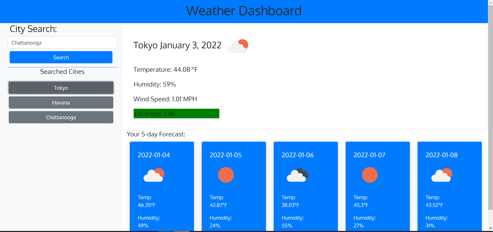
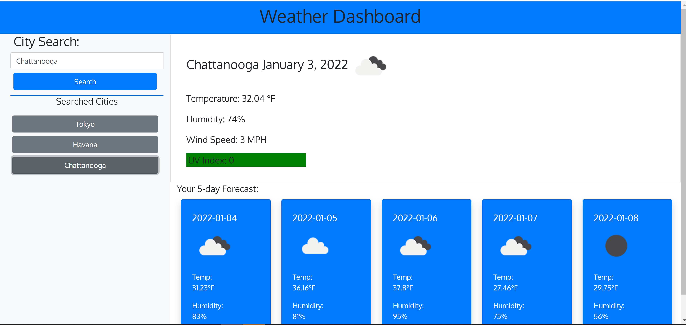

# Weather-Dashboard
As a traveler, I want to see the weather outlook for multiple cities, so that I can plan a trip accordingly.

## Introduction:
I made a weather dashboard from scratch that runs in the browser. Users can search for different cities to view the current weather and the weather forecast.

## General Information:

In this project, I used Bootstrap, jQuery, JavaScript, and the OpenWeather API to fetch weather data based on user input. Local storage is used to store persistent data and users can click on past searches to bring up the weather for those cities. Each search includes the following information:
1. City name
2. Date
3. An icon that represents the weather condition (sunny, rainy, etc.)
4. Temperature (Fahrenheit)
5. Wind speed (MPH)
6. Humidity (%)
7. UV Index

The UV index is displayed with numbers that correspond with a color. The color indicates whether the UV index is low or severe.
1. Green = Low
2. Yellow = Moderate
3. Orange = Medium
4. Red = Very high
5. Purple = Extreme

The weather conditions, date, temperature, and humidity are also included in a 5-day forecast at the bottom of the page.

I used the following  tools:
1. HTML
2. CSS
3. JavaScript
4. jQuery
5. Moment.js
6. Bootstrap
7. OpenWeather API (Server-Side)
8. Google Fonts

## Screenshots:

## Built with:

1. Visual Studio Code
2. Chrome DevTools
3. A little bit of markdown

## GitPages Link:

You can find my website here:
https://mully7773.github.io/Calendar-Application/

## Author:

Nick Mullenmeister